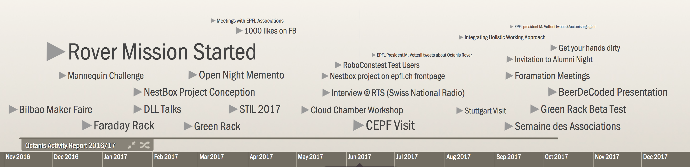

---
#### Minutes from the Ordinary General Assembly of the Association Octanis
---

__Date and Time__: 19.10.2017, 20:20 

__Place__: Univercité, Chemin du Closel 5, CH-1020 Renens

__Present Members (10)__:
  * Guillaume Thivolet
  * Ana Roldan
  * Johannes Wüthrich
  * Marion Curdy
  * Beat Geissmann
  * Luc Patiny
  * Quentin Cabrol
  * Raffael Tschui
  * Samir (Sam) Sulaimanov
  * Jeroen Buitendijk (arrived after the first two votes)

__Excused__: Franziska Meinherz

__Chair__: Samir Sulaimanov (President)

__Minutes__: Raffael Tschui (Vice-President)

__Guests__: -

__Agenda__:
 * Welcome
 * Approval of the minutes of the last extraordinary general assembly of November 23rd, 2016
 * Approval of the agenda
 * Financial result and balance of 2016/17 and report on our activities
 * Discharge of the 2016/17 committee
 * Election of the new committee
 * Election of the statutory auditors
 * Updating of list of active members
 * Miscellaneous

The agenda is approved by all present 9 members.

The minutes of the last GA of November 23rd, 2016 are approved by 7 members, 2 members who were not part of the association last year abstained.

---

The presentation slides of this general assembly can be viewed here: https://docs.google.com/presentation/d/1_9nHuhU7EXEWm-Wns5DraN2BOVlueTt7SxgXwBXjtvM/edit?usp=sharing

#### 1. Financial result and balance of 2016/17 and report on our activities

Quentin, the treasurer, summarizes the accounting of the financial year of the association: 1.10.2016 - 30.9.2017. The association's accounting has closed with a net benefit of 1209.40 CHF and now has financial reserves of total 2122.61 CHF. The total transaction volume was 8737.54 CHF on the revenue side versus 7528.14 CHF on the spending side. 

Beat Geissmann and Jeroen Buitendijk in their function as statutory auditors have previously confirmed that the association's accounting was carried out correctly. 

A large portion of the spendings (91.4%) were made on hard- and software purchases, while the remaining accounts for fees, advertisements and communication.

More than half of the revenues came from the DLL subvention of the rack built and installed at EPFL, while a quarter comes from membership fees and the remaining was generated in rover and nestbox projects, as well as workshops.

Raffael clarifies that project spendings are always carried by the project itself and not by the association membership fees. For projects that currently have higher spendings than revenues, the association is awaiting payment of outstanding invoices and therefore a net benefit can be awaited for the next year.

Quentin presents the budget proposal for 2017/18 where the association counts on more sponsoring and subventions and aiming to reduce the contribution from members.

Sam adds that, because Octanis created a lot of value on EPFL campus, the association will be able to capture that value, possibly in form of subventions which would be awarded to members in form of mini grants, or other support from EPFL. 

The association counts on the help of its members to create and submit relative sponsoring and subvention documents.

#### 2. Activity report

Interactive Timeline: http://timeglider.com/t/e892a33ceefd32e65992?min_zoom=1&max_zoom=100

Ana presents the activity report of the last year, including events like:
- Bilbao Maker Faire,
- Mannequin Challenge as first event as EPFL association,
- Rover mission start
- Construction of the first rack
- Presentation to DLL and construction of rack for DLL
- STIL at EPFL
- Radio interview about Nestbox project at the RTS
- Start of Open nights at EPFL
- Visit of the CEPF in the Octanis-animated space
- Visit at University of Stuttgart (which built a connection to aerospace students association)
- Start of holistic working approach (holacracy)
- Invitation to the alumni night
- Stand at semaine des associations (including a live demo of the rack)
- Beta Test start of the Green Rack, including offered workshop
- BeerDeCoded presentation

Raffael points out that for the Bilbao maker faire, two members got the flights GVA <-> Bilbao and food during 3 days paid by the Organisers. Members are encouraged to sign up for these opportunities, which are always posted in Slack.

Sam adds that the radio interview triggered many reactions, e.g. from EPFL professors which opened the doors for Octanis to be more in touch with educators. This led to multiple opportunities to communicate that rapid prototyping does not need to come with a large investment, but mostly requires a lot of work and community building.

At the "semaine des associations", we realized that the average EPFL student population is much different form those who come for example to Hackuarium and that it is difficult to communicate the working approach carried out at Octanis. 
Luc responds that the cause for this might be that there is too little interdisciplinary work/interaction happening at EPFL, which was for example planned with the "teaching bridge". Octanis is currently taking this role of a bridge.

Sam presents the upcoming events, which are exactly an example of this bridge, because they are (among others) part of a conference series with Hackuarium.

#### 3. Discharge of the committee

The executive committee has been discharged for the year 2016/17 and the financial result has been approved by all (10) present members.

#### 4. Election of the Executive Committee

Sam introduces the Holacracy organisation, which is applied to the structure of the board (and other projects). On https://sheepdog.octanis.org/, everyone can transparently see the roles inside the board and their accountabilities and domains. Weekly 25-minutes tactical meetings are the formal way to get all board members in sync and the outcomes of the meetings are also visible on Sheepdog, e.g. the next actions and projects for each board member.

Sam points out that an englobing circle in the association's organisation diagram does not represent a hierarchical order, but that the circles inside inherit the purpose of the outer circles. 

### Vote

Marion has become president of Dance Square and is therefore resigning as a board member. The board and association thank her for her 3 year-long dedication to her post.

The following members have been elected to the board by all present members:
  * Samir Sulaimanov (President)
  * Raffael Tschui (Vice-President)
  * Quentin Cabrol (Treasurer)
  * Ana Roldan
  * Johannes Wüthrich (new)
  * Franziska Meinherz (new)

Individual roles of board members are assigned inside the Holacracy framework and can be viewed on https://sheepdog.octanis.org/index.php/roles. Only the statutory functions: president, vice-president and treasurer have been assigned during the General Assembly.

#### 5. Statutory Auditors

Beat Geissmann and Jeroen Buitendijk have been voted into the function as statutory auditors for 2017/18 by all (10) present members.

#### 6. Updating of list of active members

As part of common practice, the board has proposed to exclude the members who have not fulfilled their membership dues during the last year. To protect these individual's privacy, their shall not be listed in this document.

As a result, Octanis counts 34 paying members, of which 9 are not EPFL/UNIL students, thereby fulfilling article 5 of the association's statutes.

The updated member's list has been approved by all (10) present members.

#### 6. Miscellaneous

The Nestbox project is planning to build a new prototype and deploying the current prototype during winter.

Rack circle: Gained new insights from today's workshop, e.g. how a new type of rack could look like.

Rover project: Mission data extraction is ongoing, interpretation is still an open task. The data needs to be analysed in order for the project team to know how to build the next rover version.

#### Closing

The General Assembly is closed at 21:45.

___

Renens, October 19th, 2017

